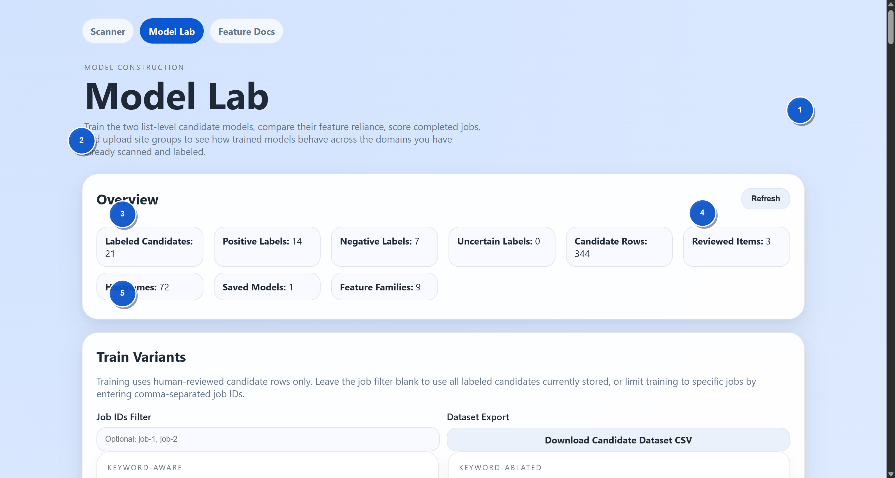
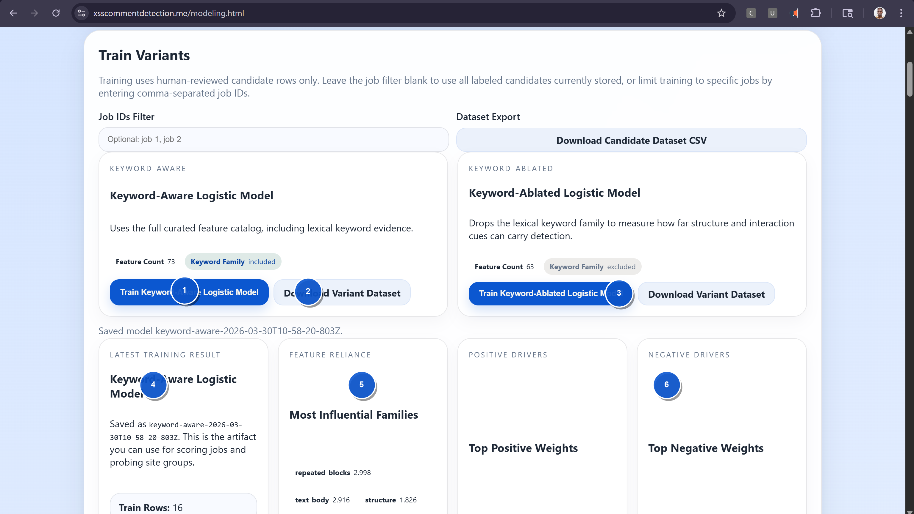
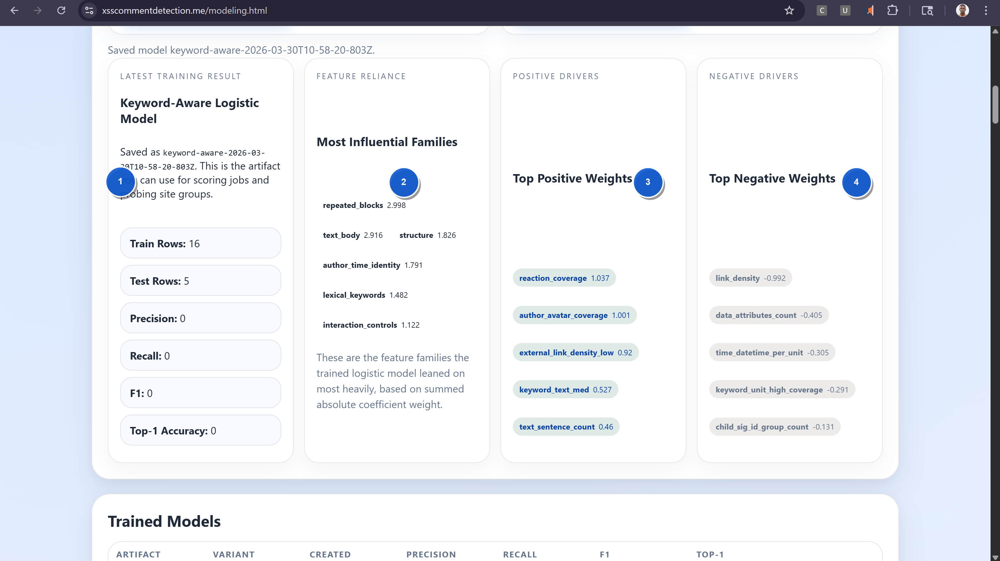
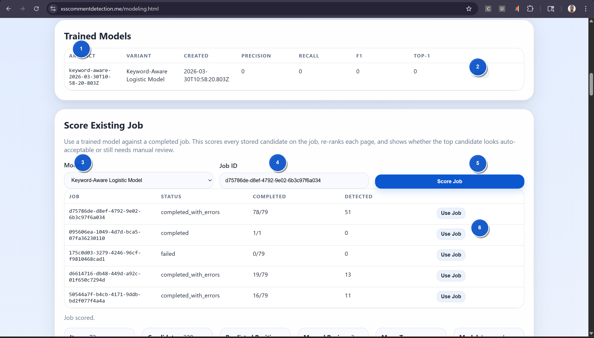
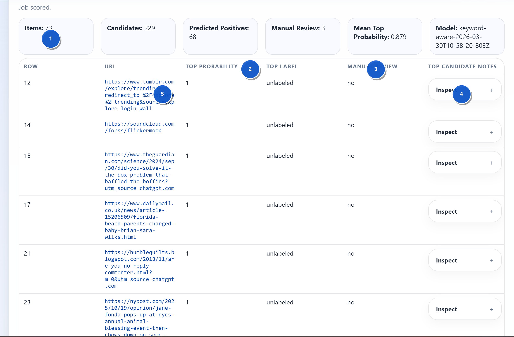
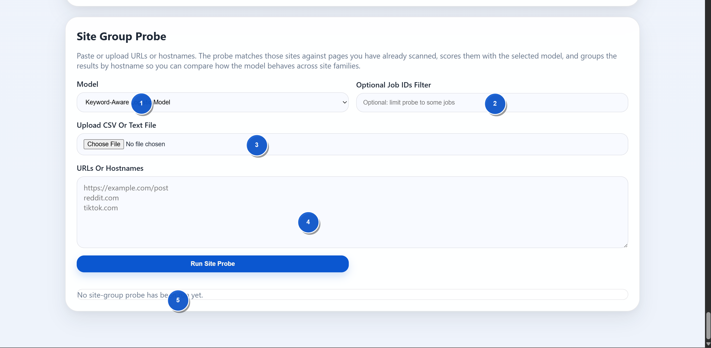

# Beginner Model Lab Training Walkthrough

This note is for a first-time user of the current modeling system.

It answers these questions in plain language:

1. What are you actually training?
2. What do you have to do before training?
3. What buttons do you click on the website?
4. Does the browser extension need the model file?
5. What does the saved model do after training?

## The first thing to understand

You are **not** training an image model right now.

The current system does **not** learn directly from screenshot pixels.

Instead, it trains a **logistic regression reranker** on **candidate rows** that come from:

- the scanned page structure
- the extracted candidate features
- the human labels you assign in the Scanner UI

So the screenshots on the page are mainly for:

- human review
- human labeling
- visual debugging

The model itself is trained from the **structured features** attached to each candidate.

Examples of those features are:

- repeated block count
- text body density
- author and timestamp evidence
- reply button coverage
- keyword evidence
- negative controls such as product-grid or nav-like signals

## What the extension does today

The extension does **not** load a model file today.

The extension only helps you capture page state and upload it to the server.

It uploads:

- a DOM snapshot
- a frozen-styles HTML snapshot when that mode is enabled
- a visible browser screenshot
- the page URL
- the page title
- optional notes

After upload, the server:

1. stores the artifacts
2. re-renders the snapshot
3. rebuilds candidate regions
4. updates the item in the Scanner UI

That means the current flow is:

1. extension captures page state
2. server updates the stored item
3. human reviews and labels candidates
4. Model Lab trains on those labels
5. server uses the trained model later for scoring

## What format the model is saved in

The trained model is saved as a **JSON artifact** on the server.

Path shape:

- `output/models/<variant-id>/<artifact-id>.json`

The artifact stores:

- model ID
- model variant
- training metadata
- vectorizer schema
- logistic regression weights
- evaluation metrics
- feature-reliance summaries

You do **not** manually pass this JSON into the extension.

Today the server is the thing that owns and uses the trained model.

## What the model can do today

After training, the saved model can be used in two places:

1. `Score Existing Job`
2. `Site Group Probe`

It does **not** currently auto-run inside the extension.

It also does **not** currently auto-score every new job by default.

Right now you train a model, save it, then explicitly choose it in Model Lab when you want to score stored data.

## What your current live data means

I checked the live modeling overview on **March 30, 2026**.

Current live counts:

- `item_count`: `104`
- `candidate_count`: `344`
- `labeled_candidate_count`: `21`
- `positive_candidate_count`: `14`
- `negative_candidate_count`: `7`
- `review_complete_binary_item_count`: `3`
- `hostname_count`: `72`
- saved models: `1`

What that means in plain language:

- you have enough data to test the workflow
- you do **not** yet have enough data to trust the model strongly

Why I say that:

- only `21` candidate rows are labeled
- only `3` items are fully reviewed in the binary sense
- the saved model's test metrics are not meaningful yet because the held-out split is tiny

So the right mindset right now is:

- use the current model to learn the workflow
- do **not** treat it as production-ready accuracy yet

## The labels that matter for training

The first model only trains on **binary human-reviewed candidate labels**.

These are the important labels:

- `comment_region` = positive
- `not_comment_region` = negative
- `uncertain` = stored, but excluded from first-pass training

That means if you want better training data, the most important action is:

- keep labeling candidates in the Scanner page

## The two model variants

The current system gives you two variants:

1. `keyword-aware`
2. `keyword-ablated`

Their difference:

- `keyword-aware` keeps keyword features such as comment/reply/review-style wording
- `keyword-ablated` removes those keyword features and forces the model to rely more on structure, interaction, author/time, and other non-keyword evidence

Why both matter:

- they help you measure whether keywords are genuinely helping
- or whether the model is cheating by over-relying on obvious words

## The complete beginner workflow

This is the simplest correct workflow to follow.

### Step 1: Create or finish scan jobs in Scanner

You first need scanned pages stored in the system.

That means:

1. upload URLs in `Scanner`
2. let the job run
3. open rows that need review
4. inspect candidate regions

### Step 2: Use the extension when the automatic scan misses or needs help

If a page needs a manual snapshot:

1. open the row in the Scanner UI
2. open the real website in another tab
3. reveal the comments manually
4. use the extension to upload the page state
5. go back to the Scanner page and wait for the item to update

The extension helps the Scanner create better candidate evidence.

It does **not** train the model by itself.

### Step 3: Label the candidates

This is the most important part.

For each reviewed item, mark:

- the true comment list candidate as `comment_region`
- clear wrong candidates as `not_comment_region`
- ambiguous ones as `uncertain` if needed

Without these labels, training cannot become meaningful.

### Step 4: Open Model Lab

Go to:

- `https://xsscommentdetection.me/modeling.html`

### Step 5: Read the Overview first

The Overview tells you whether training is even worth doing yet.

You should especially look at:

- labeled candidates
- positive labels
- negative labels
- reviewed items
- saved models

### Step 6: Decide whether to use a Job IDs filter

There is an optional `Job IDs Filter` box in the training section.

Leave it blank if you want:

- all labeled candidates from all jobs

Use it if you want:

- only certain jobs
- to exclude noisy early jobs
- to compare a cleaner subset

Format:

- comma-separated job IDs

Example:

```text
job-id-1, job-id-2, job-id-3
```

### Step 7: Train one or both variants

Click one of:

- `Train Keyword-Aware Logistic Model`
- `Train Keyword-Ablated Logistic Model`

What happens when you click:

1. the server collects labeled candidate rows
2. it builds the training dataset
3. it trains the selected logistic regression model
4. it evaluates the model
5. it saves the JSON artifact
6. it updates the page with the latest training result

### Step 8: Read the training result correctly

After training, the page shows:

- latest training result
- train row count
- test row count
- precision
- recall
- F1
- top-1 accuracy
- feature reliance
- top positive weights
- top negative weights

This is what those sections mean:

- `Latest Training Result`: basic summary and saved artifact ID
- `Feature Reliance`: which feature families mattered most overall
- `Top Positive Weights`: evidence that pushes the model toward "this is a comment region"
- `Top Negative Weights`: evidence that pushes the model away from that conclusion

### Step 9: Use the saved model

Once a model is trained, it appears in `Trained Models`.

You can click:

- `Use`

That pre-fills the model selector for:

- `Score Existing Job`
- `Site Group Probe`

### Step 10: Score a completed job

This is how you ask:

- "How would this saved model rank the candidates on a real completed job?"

In `Score Existing Job`:

1. choose a saved model
2. paste a completed job ID
3. click `Score Job`

What happens:

1. the server loads the saved model artifact
2. it rebuilds the candidate dataset from the already stored job items
3. it scores every candidate for every item
4. it picks the highest-ranked candidate per item
5. it shows whether manual review is still suggested

Important:

- this does **not** re-scan the live website
- it only scores the candidates already stored for that job

### Step 11: Inspect the scored results

After scoring, the results table shows:

- row number
- URL
- top probability
- top label if already labeled
- whether manual review is still suggested
- an `Inspect` panel with sample text and top feature contributors

This is useful because you can see:

- where the model looks confident
- where it still wants human review
- what evidence influenced its top prediction

### Step 12: Use Site Group Probe

This is for grouped analysis, not live crawling.

You can paste or upload:

- full URLs
- or just hostnames

Accepted file types:

- `.csv`
- `.txt`

You can also paste one entry per line into the text box.

Examples:

```text
https://example.com/post
reddit.com
tiktok.com
youtube.com
```

What the probe does:

1. normalizes those entries to hostnames
2. looks for already stored items from those hostnames
3. scores those items with the selected model
4. groups the results by hostname

What it does **not** do:

- it does not fetch brand new live websites
- it only works on sites you already scanned and stored

## What to do right now if you are new

If I were guiding you live, I would tell you to do this exact sequence:

1. stay in `Scanner`
2. finish labeling more rows first
3. make sure you create both positives and negatives
4. once you have more reviewed rows, open `Model Lab`
5. train both variants
6. compare their feature reliance
7. score one completed job you know well
8. inspect several rows manually
9. use `Site Group Probe` on hostnames you care about

## My practical recommendation for your current dataset

Because the current live dataset is still small, I would use the model **for workflow learning only** right now.

Pragmatically:

- keep training both variants
- but spend most of your effort on more human labeling first

If you want a better early baseline, I would aim for:

- more reviewed items
- more balanced positives and negatives
- more hostnames represented in the labeled set

## What you are not supposed to do

You are **not** supposed to:

- export a model file and manually load it into the extension
- give the extension a CSV of weights
- convert the model into an image classifier
- expect the model to work well from screenshots alone

That is not how this version works.

## What may be added later

The current system can be extended later so that:

- a chosen default model auto-scores new completed jobs
- manual extension uploads trigger auto-scoring immediately
- the extension requests server-side scoring after upload
- the browser extension shows model feedback after capture

But that is **future behavior**, not the current one.

## Screenshot Walkthrough

The marked screenshots below use numbered circles.

Read the legend under each image.

### Screenshot 1: Model Lab overview



Legend:

- `1` You are on the `Model Lab` page.
- `2` This short paragraph explains the purpose of the page: training, scoring, and site probing.
- `3` These overview counters summarize how much labeled training data currently exists.
- `4` `Refresh` reloads the overview, model list, and recent jobs from the server.
- `5` The count boxes are your health check. If these numbers are tiny, treat training as experimental only.

### Screenshot 2: Train Variants section



Legend:

- `1` Click here to train the `keyword-aware` model.
- `2` This button downloads the dataset for that variant so you can inspect the rows outside the app.
- `3` Click here to train the `keyword-ablated` model.
- `4` This card shows the latest saved artifact summary after training finishes.
- `5` This card shows which feature families mattered most.
- `6` These cards show the strongest positive and negative feature drivers.

### Screenshot 3: Training result interpretation



Legend:

- `1` Training metrics such as train rows, test rows, precision, recall, F1, and top-1 accuracy.
- `2` Family-level reliance. This helps you see whether the model is leaning mostly on structure, keywords, author/time, and so on.
- `3` Top positive weights. These are the features pushing the model toward a positive prediction.
- `4` Top negative weights. These are the features pushing the model away from a positive prediction.

### Screenshot 4: Trained Models and Score Existing Job



Legend:

- `1` This table lists saved model artifacts.
- `2` `Use` selects that model for the scoring and site-probe forms below.
- `3` The model selector for scoring a completed job.
- `4` Paste a completed job ID here.
- `5` Click `Score Job` to run the saved model against the already stored candidates on that job.
- `6` `Use Job` copies a recent job into the Job ID field for convenience.

### Screenshot 5: Scored job results



Legend:

- `1` These boxes summarize the scored job: item count, candidate count, predicted positives, manual review count, and mean top probability.
- `2` `Top Probability` is the model's confidence for the highest-ranked candidate on that row.
- `3` `Manual Review` tells you whether the row still needs a human check.
- `4` `Inspect` opens more detail about the top candidate and the strongest feature contributors.
- `5` The URL column helps you relate each prediction back to the original page.

### Screenshot 6: Site Group Probe



Legend:

- `1` Choose the saved model to use for the probe.
- `2` Optionally limit the probe to items from specific jobs.
- `3` Upload a `.csv` or `.txt` file containing URLs or hostnames.
- `4` Or paste URLs/hostnames directly into the text area, one per line.
- `5` This bottom area is where probe status and grouped results appear after you run it.

## Short answer to your original question

If I compress everything into one simple answer:

- train by labeling candidates in `Scanner`, then clicking a train button in `Model Lab`
- the model is saved as a server-side JSON artifact
- you do **not** give that model file to the extension
- the extension only uploads page captures
- the server uses the trained model later when you score stored jobs or probe stored site groups

## If you want the next improvement

The most useful next improvement would be:

- automatically score an item right after a manual extension upload using a selected default model

That would make the extension feel directly connected to the trained model.
