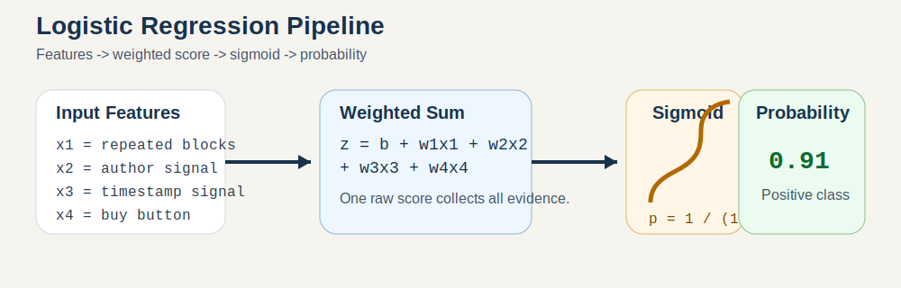
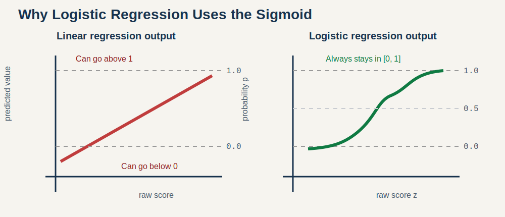
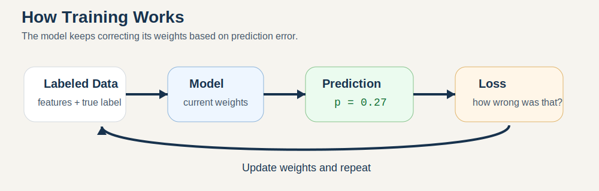
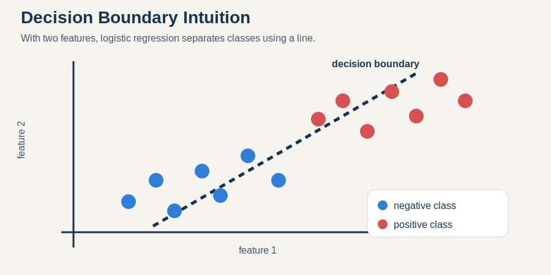

# Beginner Logistic Regression Guide

Date:

- `2026-03-31`

## Why this note exists

`Logistic regression` is one of the first machine learning models people run into.

It is also one of the most confusingly named.

Beginners often ask:

- if it says `regression`, why is it used for `yes/no` classification?
- what is the model actually doing inside?
- what do the weights mean?
- why do people keep drawing an S-shaped curve?
- how does the model learn from mistakes?

This note explains logistic regression from the ground up in very plain language.

It is written for someone who is new to machine learning, not for someone cramming for a statistics exam.

## The short version first

Logistic regression is a model that:

1. looks at a set of input features
2. gives each feature a weight
3. adds those weighted feature values into one score
4. converts that score into a probability between `0` and `1`
5. uses that probability to decide between two classes such as:
   - spam or not spam
   - comment region or not comment region
   - fraud or not fraud
   - sick or not sick

That is the whole core idea.

Everything else is detail around:

- how the score is built
- why we squash it into a probability
- how the weights get learned

## If you remember only four things

Keep these four facts:

1. Logistic regression is usually a classification model, even though its name says `regression`.
2. It turns feature values into a single score.
3. It pushes that score through an S-shaped function called the `sigmoid`.
4. The output is a probability like `0.91`, not just a raw yes/no label.

## Why the name is so weird

This is the first beginner trap.

`Logistic regression` is not called that because it predicts a continuous value like house price or temperature.

It is called `logistic` because it uses the `logistic function`, which is the S-shaped curve:

`p = 1 / (1 + e^-z)`

You do not need to memorize that formula yet.

The important idea is:

- the model first builds a raw score called `z`
- then it converts `z` into a probability `p`

So in practice, logistic regression is most often used for `classification`, especially binary classification.

## The easiest mental model

Imagine a strict bouncer at a club.

The bouncer does not make decisions randomly.

They look at signals:

- is the person on the guest list?
- do they have valid ID?
- are they acting suspiciously?
- are they a VIP?

Each signal pushes the decision a little:

- some signals increase confidence
- some signals decrease confidence

The bouncer mentally adds everything up into one internal score.

Then:

- if the score is very high, entry is very likely
- if the score is very low, entry is very unlikely
- if the score is around the middle, the bouncer is unsure

That is basically logistic regression.

The model is a scorecard machine.

## The full pipeline at a glance

The diagram above shows the basic flow:

- features go in
- weights act on them
- one raw score comes out
- the sigmoid converts that score into a probability

## Step 1: What are features?

A `feature` is just a measurable input the model can use.

Examples:

- email contains the word `free`
- page has repeated comment-like blocks
- user income is above a threshold
- tumor size is large
- message has many links
- product page has many review signals

For a simple comment-region detector, features might look like:

- `repeated_child_blocks = 1`
- `author_name_signal = 1`
- `timestamp_signal = 1`
- `add_to_cart_present = 0`
- `comment_keyword_present = 1`

The model does not understand the world directly.

It only sees numbers.

That means the quality of the features matters a lot.

## Step 2: The model builds a raw score

Logistic regression computes a score like this:

`z = b + w1*x1 + w2*x2 + w3*x3 + ...`

Where:

- `x1`, `x2`, `x3` are feature values
- `w1`, `w2`, `w3` are learned weights
- `b` is a bias term, sometimes called the intercept
- `z` is the raw score before it becomes a probability

Plain English version:

- each feature gets multiplied by a weight
- all those pieces are added together
- the model ends up with one number

### What the weights mean

A weight tells you how strongly a feature pushes the prediction.

- positive weight: pushes the prediction toward the positive class
- negative weight: pushes the prediction away from the positive class
- larger magnitude: stronger influence
- near zero: little effect

Very roughly:

- `+3.0` is a strong push upward
- `+0.2` is a weak push upward
- `-2.5` is a strong push downward
- `0.0` means the model learned almost no influence from that feature

## A tiny worked example

Suppose we want to predict whether a page region is a true comment region.

The model uses these features:

- `repeated_child_blocks = 1`
- `author_name_signal = 1`
- `timestamp_signal = 1`
- `add_to_cart_present = 0`
- `comment_keyword_present = 1`

And suppose the learned weights are:

- bias `b = -1.2`
- repeated child blocks: `+1.8`
- author name signal: `+1.3`
- timestamp signal: `+0.9`
- add to cart present: `-2.5`
- comment keyword present: `+1.7`

Then the raw score is:

`z = -1.2 + 1.8(1) + 1.3(1) + 0.9(1) - 2.5(0) + 1.7(1)`

`z = -1.2 + 1.8 + 1.3 + 0.9 + 0 + 1.7`

`z = 4.5`

That raw score is strongly positive.

So the model should end up with a high probability for `yes, this is a comment region`.

But `4.5` is not itself a probability.

That is why we need the next step.

## Step 3: Turn the raw score into a probability

This is where the sigmoid comes in.

The sigmoid takes any real number:

- `-100`
- `-2`
- `0`
- `3`
- `1000`

and maps it into the safe probability range:

- between `0` and `1`

Here is the rough intuition:

- very negative score -> probability near `0`
- score near `0` -> probability near `0.5`
- very positive score -> probability near `1`

### A few example values

| Raw score `z` | Probability `p` | Plain meaning |
| --- | ---: | --- |
| `-6` | `0.002` | almost certainly negative |
| `-2` | `0.119` | probably negative |
| `0` | `0.500` | completely on the fence |
| `2` | `0.881` | probably positive |
| `6` | `0.998` | almost certainly positive |

So in our example, `z = 4.5` becomes a probability very close to `1`.

## Why not use the raw score directly?

Because the raw score has problems:

- it is not bounded
- it is hard to interpret
- it is not a clean probability

If a model gave you:

- `-11.8`
- `0.7`
- `23.4`

those are hard to reason about as human-readable confidence values.

Probabilities are much easier:

- `0.03`
- `0.54`
- `0.97`

## Why not just use linear regression?

This is another common beginner question.

Linear regression produces outputs on an unrestricted line.

That means it can predict:

- `-3.2`
- `1.8`
- `14.7`

Those are not valid probabilities.

For yes/no classification, we usually want outputs that behave like probabilities.

That is why logistic regression is a better fit.

The left side shows the problem with a straight line:

- it can go below `0`
- it can go above `1`

The right side shows why the sigmoid is so useful:

- it always stays between `0` and `1`
- it changes most quickly in the uncertain middle region
- it flattens out near extreme confidence

## Step 4: Convert probability into a label

At some point, a system usually needs a final yes/no answer.

That is done with a `threshold`.

Most basic examples use:

- if probability >= `0.5`, predict positive
- otherwise, predict negative

But `0.5` is not a law of nature.

You can choose other thresholds.

For example:

- threshold `0.8` makes the model more conservative
- threshold `0.3` makes the model more willing to say positive

This matters because classification is not only about the model.

It is also about the product decision rule.

## A practical threshold example

Suppose you are building a fraud detector.

If you predict fraud too easily:

- many honest users get flagged

If you predict fraud too cautiously:

- you miss real fraud

So the threshold depends on the cost of mistakes.

That same idea applies in this repo too.

For comment detection:

- a false positive can make the system confidently point at the wrong page region
- a false negative can make the system miss a real comment area

The threshold is a product choice, not just a math choice.

## What training means

Training is just the process of finding good weights.

The model begins with weights that are not useful yet.

Then it repeatedly sees labeled examples:

- input features
- correct answer

For each example, it:

1. predicts a probability
2. compares that probability with the true label
3. measures how wrong it was
4. nudges the weights so future predictions improve

That loop repeats over and over.

The model is not memorizing rules that a human typed in.

It is adjusting its weights based on data.

## The idea of loss

The model needs a way to know how bad a prediction was.

That is what the `loss function` does.

For logistic regression, the common loss is `log loss`, also called `cross-entropy loss`.

The exact formula is:

`loss = -( y*log(p) + (1-y)*log(1-p) )`

You do not need to become fluent in that formula right now.

What matters is the behavior:

- if the true label is `1` and the model predicts `0.99`, the loss is small
- if the true label is `1` and the model predicts `0.02`, the loss is large
- if the true label is `0` and the model predicts `0.98`, the loss is large

So the loss punishes confident wrong answers especially hard.

That is good.

We want the model to feel a strong correction when it is confidently wrong.

## How the model actually updates weights

The standard training method is `gradient descent` or one of its variants.

Very plain explanation:

- the model checks which direction would reduce the loss
- then it moves the weights a small step in that direction
- then it repeats

You can think of it like hiking downhill in fog.

You cannot see the whole mountain.

But you can feel which nearby direction slopes downward.

So you keep taking small downhill steps.

Eventually you reach a low area where the loss is much smaller than where you started.

## What the bias term does

The bias `b` is easy to overlook.

It is the model's built-in starting point before the features add their influence.

If every feature were `0`, the score would just be:

`z = b`

So the bias controls the model's default tendency.

Example:

- if positives are rare, the learned bias may be negative
- that means the model starts skeptical and needs positive evidence to move upward

## Interpreting coefficients as a beginner

One reason logistic regression is still loved is that the learned weights are inspectable.

If a feature has:

- a strong positive weight, it pushes the model toward `yes`
- a strong negative weight, it pushes the model toward `no`

That gives you a readable story.

For example:

- `comment_keyword_present` might end up strongly positive
- `add_to_cart_present` might end up strongly negative
- `table_row_structure` might be negative if it often signals non-comment layouts

That kind of interpretability is very useful in real systems.

## Important warning about weight size

Do not compare weight magnitudes blindly without thinking about feature scaling.

Why:

- a feature that ranges from `0` to `1`
- and a feature that ranges from `0` to `10,000`

do not live on the same scale.

That can distort how the weights look.

So when people interpret logistic regression coefficients seriously, they often:

- standardize numeric features
- or at least keep feature scales in mind

For binary features, interpretation is usually easier.

## The decision boundary

After the model turns inputs into a probability, the threshold creates a boundary between classes.

With logistic regression, that boundary is linear in feature space.

That sentence sounds harder than it is.

It simply means:

- in two dimensions, the split is a line
- in three dimensions, the split is a plane
- in many dimensions, the split is a flat hyperplane

This matters because logistic regression is fundamentally a linear model.

It can be very strong when the feature engineering is good.

But it does not naturally create complex curvy boundaries unless:

- the features themselves already encode that complexity
- or you add transformed features such as interactions or polynomials

## This is why feature engineering matters so much

For logistic regression, feature design is a huge part of the game.

If the raw inputs are poor, the model has little to work with.

If the features are informative, logistic regression can perform surprisingly well.

That is why so many practical systems use it as a first baseline.

It is:

- simple
- fast
- interpretable
- often strong when features are good

## What logistic regression is good at

Logistic regression is a good choice when:

- the problem is binary classification
- you want probabilities, not just labels
- you want a model that is fast to train
- you want a model that is easy to inspect
- you need a strong baseline before trying more complex models

It is especially nice in projects where explainability matters.

You can inspect:

- which features push toward positive
- which features push toward negative
- how strongly they matter

## What logistic regression is not good at

It has limits.

### 1. It is a linear model

If the real relationship is highly nonlinear and your features do not expose that structure, logistic regression may struggle.

### 2. It depends heavily on feature quality

Bad features produce bad results.

### 3. It can be misread as "causal"

A positive weight does not automatically mean a feature causes the outcome.

It only means the feature is useful for prediction in the training data.

### 4. Its probabilities are not magical truth

A probability of `0.92` means:

- according to this model and this training data, the example looks very positive

It does not mean:

- the universe guarantees the answer with 92% metaphysical certainty

### 5. Correlated features can complicate interpretation

If several features carry overlapping information, individual weights can shift around in ways that still make the overall model work but make human interpretation messier.

## Common beginner confusion: "Is the output confidence?"

Sort of, but be careful.

The output is a model probability.

That means:

- the model thinks the example belongs to the positive class with that probability

But whether the number is well calibrated depends on:

- the data
- the features
- the training process
- class balance

So `0.95` should not be treated like a sacred truth number.

It is a model estimate.

## Common beginner confusion: "Why does score 0 mean probability 0.5?"

Because the sigmoid is centered that way.

When `z = 0`:

`p = 1 / (1 + e^0) = 1 / (1 + 1) = 0.5`

So:

- negative scores mean probability below `0.5`
- positive scores mean probability above `0.5`

This makes the raw score easy to reason about:

- sign tells direction
- magnitude tells strength

## Common beginner confusion: "Can logistic regression handle more than two classes?"

Yes, but basic logistic regression is usually taught as binary classification first.

For multiple classes, people often use:

- one-vs-rest logistic regression
- or the softmax / multinomial extension

But if you are a beginner, learn the binary case first.

That is the core concept.

## A very concrete yes/no story

Suppose we want to predict whether an email is spam.

Useful features might be:

- contains many exclamation marks
- contains suspicious keywords
- contains many links
- sender is unknown
- user has marked similar emails as spam before

The model learns weights like:

- suspicious keywords: strongly positive
- many links: positive
- sender in trusted contacts: negative
- user has replied before: strongly negative

The model adds all that evidence together.

Then it outputs a probability like:

- `0.97` spam
- `0.11` spam

That is logistic regression doing its job.

## A concrete story inside this repo

This repo uses logistic regression in the modeling system for candidate ranking.

The simplified idea is:

- each candidate page region gets converted into features
- the model estimates the probability that the candidate is the true comment region
- candidates can then be ranked by that probability

So in this project, logistic regression is not an abstract textbook object.

It is a practical scoring function that says:

- "given these features, how likely is this candidate to be the correct comment region?"

That is exactly the kind of task logistic regression is good at.

## Logistic regression versus harder models

Why not jump straight to:

- neural networks
- gradient boosted trees
- transformers

Sometimes you should not.

A beginner-friendly reason to start with logistic regression is:

- it sets a clean baseline
- it trains quickly
- it is easier to debug
- it tells you whether your features are useful at all

If logistic regression performs decently, that often means your features carry real signal.

If it performs terribly, a fancier model may not rescue you as much as you hope.

## A good way to think about the math

You do not need to worship the formula.

Think of logistic regression as:

- a weighted scorecard
- plus a probability squashing function
- trained by repeated correction

That mental model is already enough to understand most practical use.

## A beginner-safe checklist for understanding any logistic regression model

When you see a logistic regression system, ask:

1. What is the positive class?
2. What are the input features?
3. Which features push probability upward?
4. Which features push probability downward?
5. What threshold is used for the final decision?
6. How is performance measured?
7. Are the probabilities being used directly, or only for ranking?

If you can answer those seven questions, you understand the model at a useful practical level.

## One sentence summary for each key concept

### Feature

A number the model can use as evidence.

### Weight

How strongly that feature pushes the answer.

### Bias

The model's default starting tendency.

### Raw score `z`

The total evidence after combining all weighted features.

### Sigmoid

The function that turns the raw score into a probability.

### Probability

The model's estimate that the example belongs to the positive class.

### Threshold

The cutoff used to turn probability into a final yes/no label.

### Loss

A number that says how bad a prediction was.

### Training

The repeated process of adjusting weights to reduce loss.

## Final intuition

If linear regression is:

- "draw a line to predict a number"

then logistic regression is:

- "build a weighted score for a yes/no question, then turn that score into a probability"

That is the simplest honest description.

## Where to read next

- [002_keyword_aware_logistic_model.md](./002_keyword_aware_logistic_model.md)
- [003_keyword_ablated_logistic_model.md](./003_keyword_ablated_logistic_model.md)
- [006_beginner_model_lab_training_walkthrough.md](./006_beginner_model_lab_training_walkthrough.md)
